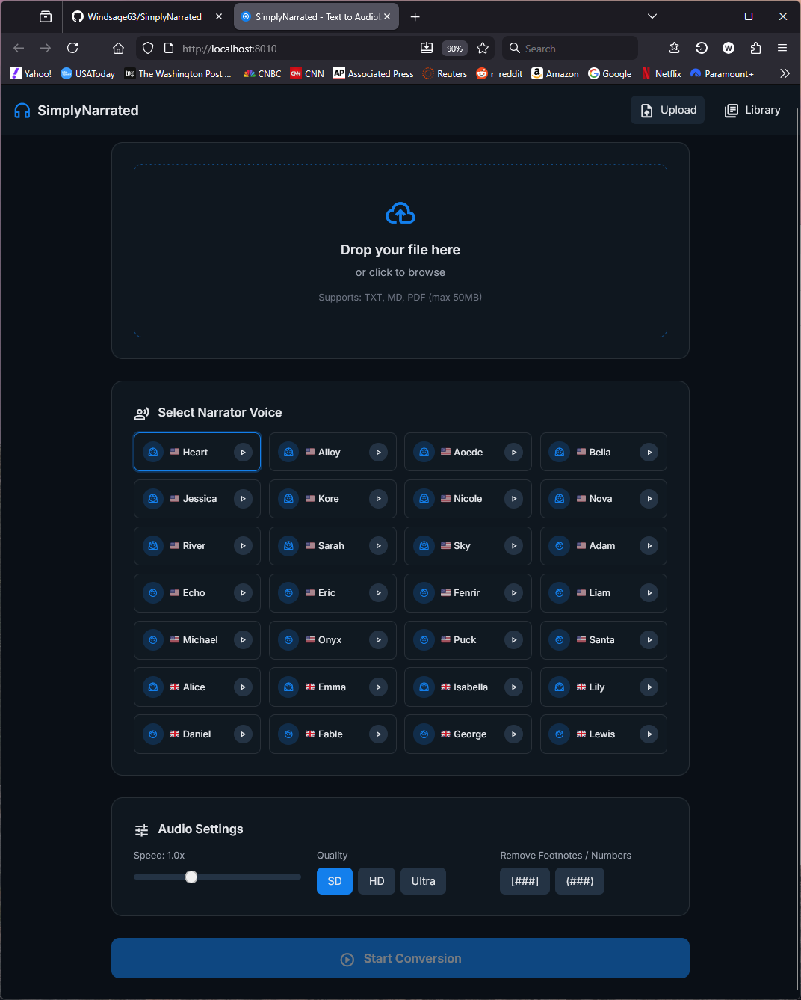
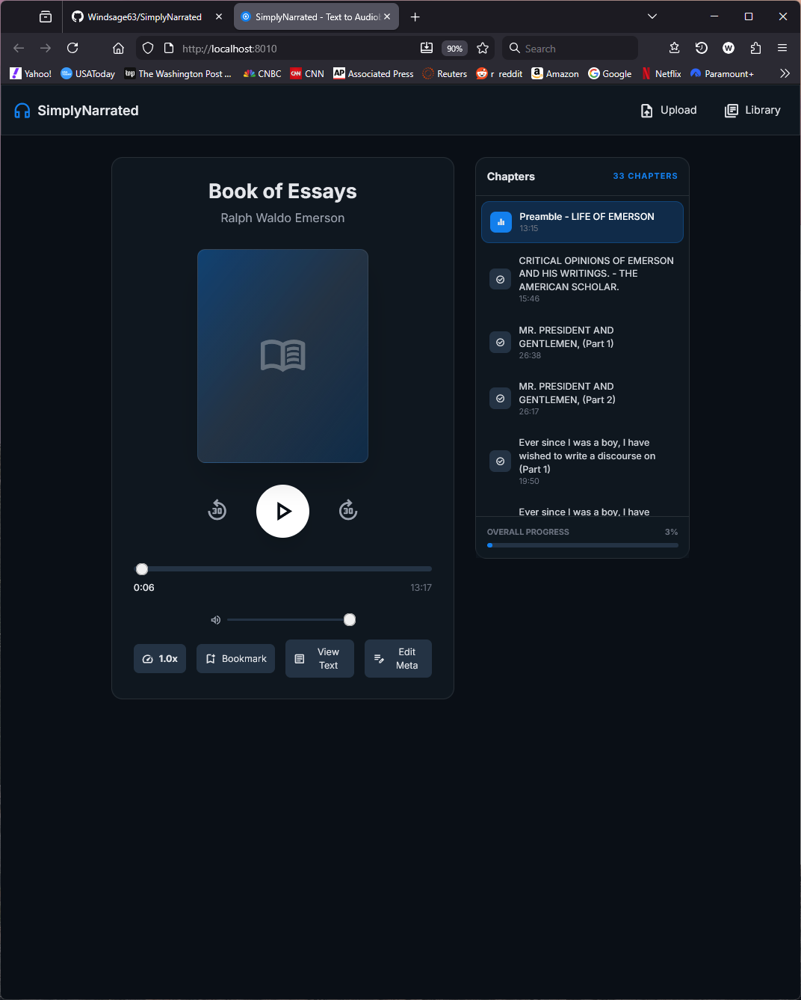

# 🎧 SimplyNarrated


A local web application that converts books and text documents (`.txt`, `.md`, `.pdf`, `.zip`) into audiobooks saved as MP3 chapter files. Designed for non-technical users, it provides a polished multi-page interface with a landing page, file upload/configuration screen, conversion progress tracker, audiobook player, and user dashboard.

The system uses the **Kokoro-82M** model running locally on GPU for high-quality, expressive speech synthesis.

## 💻 Intuitive Creation Screen



## ✨ Features

- **Local Inference**: Uses Kokoro-82M TTS model running locally. Includes pre-distributed voice tensors for zero-download voice switching.
- **Dual-Region Support**: Automatic selection of American ('a') or British ('b') G2P rules based on voice selection.
- **Memory Efficient**: Shares a single base model across multiple language pipelines to save RAM.
- **Multiple Formats**: Supports uploading TXT, MD, PDF, and Gutenberg ZIP (HTML) files.
- **Gutenberg Import**: Upload Project Gutenberg HTML ZIP downloads — the app extracts the HTML text and cover image automatically.
- **Smart Chunking**: Splits text into natural chapters or segments.
- **Early Chapter Estimate**: Upload response includes an estimated chapter count before generation starts.
- **Audiobook Player**: Built-in player with progress tracking and bookmarks.
- **Library Management**: Dashboard to manage your converted books.
- **Cover Management**: Upload and serve JPG/PNG cover images per book.
- **Reliable Jobs**: Persisted job ledger with restart recovery and bounded concurrent processing queue.
- **Modern UI**: Polished interface with dark mode support.

## 📌 Current Product Scope

- Output format is currently **MP3-only**.
- Voice generation is currently **single-narrator voice** during conversion.
- The landing page is intentionally lightweight and currently uses no custom brand artwork.

## 🎮Simple Media Player



## 🚀 Quick Start (One-Click Setup - Seriously Recommended)

The easiest way to get started — no Python installation required. This uses a pre-configured Python environment with all dependencies installed.

1. **Run the installer**: Double-click `install.bat` (or right-click → *Run as administrator*).
   - Select your GPU when prompted (RTX 50 series, RTX 30/40 series, or CPU only).
   - The script downloads a portable Python environment and installs all dependencies automatically.
2. **Launch the app**: Double-click `run.bat`.
3. **Open in browser**: Navigate to `http://localhost:8010`.

> **Note:** First-time installation downloads ~2 GB of dependencies (Python + PyTorch + models). Ensure you have a stable internet connection.

## 🚀 Running the Application

After installation, use `run.bat` to start SimplyNarrated at any time:

- Double-click `run.bat` — it launches the server and opens your browser automatically.
- The app runs at `http://localhost:8010`.

---

## 🛠️ Manual Installation (for advanced users)

For advanced users who prefer to manage their own Python environment.

### Prerequisites

- Python 3.12
- NVIDIA GPU with CUDA support (recommended for performance)

### Setup Steps

1. **Install PyTorch with CUDA support** (Important: do this first):

   ```bash
   # RTX 50 series (Blackwell) — CUDA 12.8
   pip install torch torchvision torchaudio --index-url https://download.pytorch.org/whl/cu128

   # RTX 30/40 series (Ampere / Ada) — CUDA 12.6
   pip install torch torchvision torchaudio --index-url https://download.pytorch.org/whl/cu126

   # CPU only (no GPU)
   pip install torch torchvision torchaudio --index-url https://download.pytorch.org/whl/cpu
   ```

2. **Install project dependencies**:

   ```bash
   pip install -r requirements.txt
   ```

3. **Start the server**:

   ```bash
   uvicorn src.main:app --reload --port 8010
   ```

4. **Open the application**: Navigate to `http://localhost:8010`.

---

## 📁 Project Structure

- `src/`: Source code
  - `api/`: FastAPI routes and endpoints
  - `core/`: Core logic (TTS engine, parser, chunker)
  - `models/`: Pydantic data models
- `data/`: Local storage for uploads and library
- `docs/`: Documentation files
- `static/`: Frontend assets
  - `voices/`: Local voice model tensors (`.pt`)
  - `voices/audio/`: Cached voice sample previews (`.mp3`)
- `tests/`: Unit and integration tests

## 📄 Documentation

- [API Reference](docs/API-Reference.md)
- [Architecture Plan](plans/architect_plan.md)
- [Landing Page Creative Brief](docs/Landing-Page-Creative-Brief.md)

## 📝 Acknowledgements

**SimplyNarrated** uses the Kokoro TTS Engine developed by Hexgrad. This project is built on top of the following resources:

- **Kokoro-82M Model**: A high-quality, lightweight TTS model. Available on [Hugging Face](https://huggingface.co/hexgrad/Kokoro-82M).
- **Kokoro Inference Library**: The official Python library for Kokoro inference. Available on [GitHub](https://github.com/hexgrad/kokoro).
